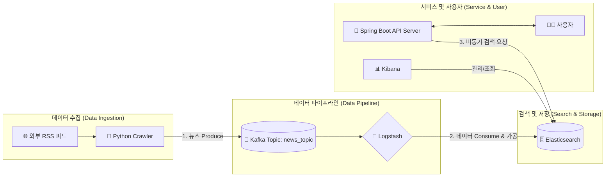

# News Archive: 실시간 뉴스 데이터 파이프라인 및 비동기 검색 엔진


## 1. 프로젝트 개요

실시간으로 생성되는 대규모 뉴스 데이터를 수집하여 사용자에게 고성능 검색 경험을 제공하는 **End-to-End 데이터 파이프라인** 프로젝트입니다.

단순한 CRUD 애플리케이션을 넘어, 데이터의 수집, 처리, 저장, 검색, 제공에 이르는 전체 과정을 **안정적이고 확장 가능한 아키텍처**로 설계하고 구현하는 것을 목표로 했습니다. 모든 인프라는 Docker Compose를 통해 코드로 관리(IaC)되며, 검색 API 서버는 **비동기(Asynchronous) 방식**으로 구현하여 높은 동시성 처리 능력을 확보했습니다.

## 2. 시스템 아키텍처



**데이터 흐름:**
1.  **[Crawler]** `Python`으로 구현된 크롤러가 여러 언론사의 RSS 피드를 주기적으로 수집합니다.
2.  **[Producer]** 수집된 뉴스 데이터는 `Kafka`의 `news_topic` 토픽으로 전송(Produce)됩니다. Kafka를 통해 데이터 생산자와 소비자를 분리하여 시스템 안정성을 확보했습니다.
3.  **[Consumer]** `Logstash`는 `news_topic`을 구독(Consume)하며, 데이터를 `Elasticsearch`가 이해할 수 있는 형태로 가공하여 인덱싱합니다.
4.  **[Search Engine]** `Elasticsearch`는 인덱싱된 데이터를 저장하고, 전문(Full-text) 검색 기능을 제공합니다.
5.  **[API Server]** `Spring Boot`로 구현된 비동기 API 서버는 사용자의 검색 요청을 받아 Elasticsearch에 쿼리하고 결과를 반환합니다.
6.  **[Management]** `Kibana`를 통해 Elasticsearch의 데이터를 시각화하고 관리합니다.

## 3. 핵심 기능 및 특징

-   **🚀 고성능 비동기 검색 API**
    -   `Spring WebFlux`와 `ElasticsearchAsyncClient`를 사용하여 모든 검색 요청을 **논블로킹(Non-Blocking) I/O**로 처리합니다.
    -   이를 통해 적은 수의 스레드로도 높은 동시 요청을 처리할 수 있어 서버 자원을 효율적으로 사용합니다.

-   **🌊 Kafka 기반의 탄력적인 데이터 파이프라인**
    -   데이터 생산(크롤링)과 소비(인덱싱) 사이에 메시지 큐를 두어, 크롤러의 장애나 데이터 처리량 급증이 전체 시스템에 영향을 주지 않는 **안정적인 아키텍처**를 구축했습니다.

-   **🧠 지능형 한국어 검색 엔진**
    -   **인덱스 템플릿(Index Template)**을 활용하여 `nori` 한국어 분석기를 자동 적용, 새로 생성되는 모든 인덱스의 검색 품질을 보장합니다.
    -   `ngram`을 이용한 **부분 일치 검색**과 `fuzziness`를 통한 **오타 교정 기능**을 제공하여 사용자 편의성을 높였습니다.
    -   크롤링 단계에서 정규식과 키워드 기반의 **낚시성 기사 필터링 로직**을 구현하여 데이터의 신뢰도를 확보했습니다.

-   **🐳 Docker Compose를 활용한 개발 환경**
    -   Kafka, Zookeeper, Elasticsearch 등 복잡한 멀티 컴포넌트 시스템을 `docker-compose.yml` 파일 하나로 손쉽게 관리합니다.
    -   이를 통해 **MSA(마이크로서비스 아키텍처)** 환경에서의 서비스 구성 및 운영 경험을 확보했으며, 인프라를 코드로 관리하는 **IaC(Infrastructure as Code)** 개념에 대한 실무적 이해를 높였습니다.

## 4. 기술 스택

-   **Backend:** `Java 17`, `Spring Boot 3.x`, `Spring WebFlux`
-   **Data Pipeline:** `Python 3.10`, `Apache Kafka`, `Logstash`
-   **Search & Storage:** `Elasticsearch 8.x`
-   **Infrastructure:** `Docker`, `Docker Compose`
-   **Crawling Libraries:** `feedparser`, `BeautifulSoup4`, `kafka-python`

## 5. 시작하기

### 사전 요구사항
-   Docker
-   Docker Compose

### 로컬 환경에서 실행하기
1.  **저장소 클론:**
    ```bash
    git clone [https://github.com/your-username/news-archive.git](https://github.com/your-username/news-archive.git)
    cd news-archive
    ```

2.  **Spring Boot 애플리케이션 빌드:**
    ```bash
    ./gradlew build
    ```

3.  **Docker Compose 실행:**
    ```bash
    docker-compose up -d
    ```
    이 명령어로 모든 서비스(Kafka, Zookeeper, Elasticsearch, Kibana, Logstash, Crawler, API Server)가 백그라운드에서 실행됩니다.

4.  **확인:**
    -   **Kibana:** `http://localhost:5601`
    -   **API 서버:** `http://localhost:8080`

### API 엔드포인트 예시
-   **뉴스 검색:**
    ```
    GET /api/news/search?keyword=경제&page=0&size=10
    ```
